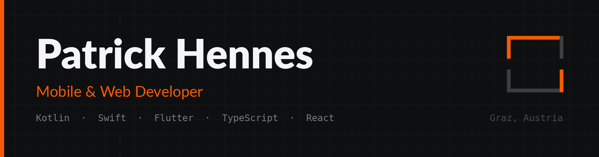
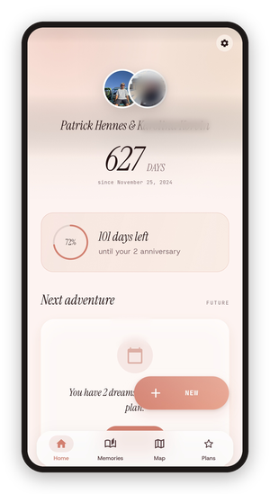
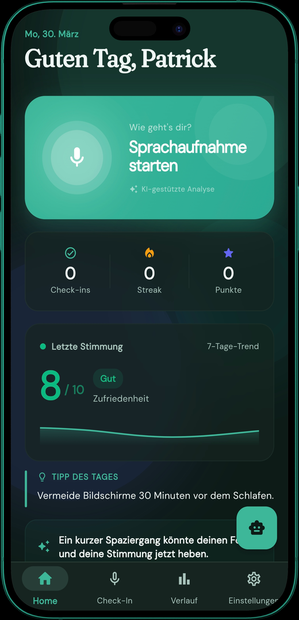
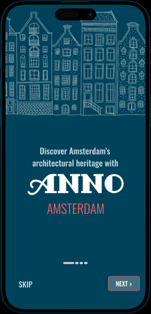
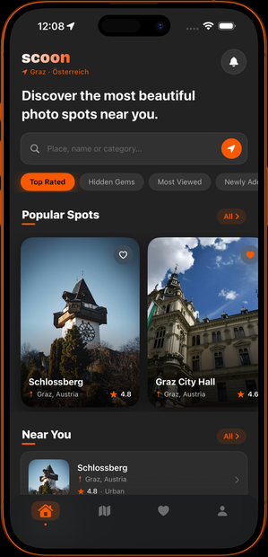

  

  
  
  
  
  
  
  
  
  

---

I build apps end to end, from the interface down to the API underneath. Native
in Kotlin and Swift, cross-platform in Flutter, React and Next.js on the web.

My day job is the other side of development: I test and release telemedicine
systems running in Austrian care programmes. Watching where software fails once
real people depend on it changed how I build it. Finishing an MSc in eHealth at
FH JOANNEUM in September 2026.

 

## Open source

| | |
|---|---|
| **[exif_scrubber](https://github.com/hennees/exif_scrubber)** | Strips EXIF and XMP from JPEGs losslessly, without re-encoding pixels. Pure Dart, no plugins, 17 tests. Extracted from a production app, where photos leaving a device carry the owner's home address in the file header. |
| **[pokedex-swiftui](https://github.com/hennees/pokedex-swiftui)** | SwiftUI app on the PokéAPI. My first iOS project, 2023. |
| **[newsapp-compose](https://github.com/hennees/newsapp-compose)** | Android news reader. Jetpack Compose, Hilt, Paging 3, clean architecture. 2024. |

Both university projects are published as they were written, each with a
section on what I would do differently now. A portfolio that only shows the
good parts is not a portfolio, it is a brochure.

 

## Built, but not open

Some of my work belongs to a client, an employer, or contains other people's
data. Those get a written account and screenshots instead of source.

<table>
<tr>
<td width="25%" align="center"></td>
<td width="75%">

**[Pairfect](https://github.com/hennees/pairfect-showcase)**

An app for two people: shared memories, a map of where you have been, plans and
daily rituals. Built solo alongside a full-time master's and a job. 78,000
lines of Dart across 11 feature modules, a serverless backend, subscriptions,
offline maps, iOS widgets. Nine months, 493 commits.

</td>
</tr>
<tr>
<td align="center"></td>
<td>

**[Amigon](https://github.com/hennees/amigon-showcase)**

Master's thesis. A system that lets people check in on their own mental health
in their own words, combining validated questionnaires with a voice check-in.
Every measurement becomes an HL7 FHIR R4 Observation. Evaluated with 20
participants, **SUS 86.8**.

</td>
</tr>
<tr>
<td align="center"></td>
<td>

**[Anno Amsterdam](https://github.com/hennees/anno-amsterdam-showcase)**

Tourism app opening up Amsterdam's undocumented historic architecture. Client
project during my exchange semester. I owned the frontend, built natively in
Kotlin and Swift for both platforms.

</td>
</tr>
<tr>
<td align="center"></td>
<td>

**[Scoon](https://github.com/hennees/scoon-showcase)**

Community platform where photographers find and share shooting locations. Own
venture with **[ITanic GmbH](https://itanic.at)** and **[Kyri Agency](https://www.kyri.agency/)**. Product concept and user flows,
including the model that pays contributors for the places they add.
[scoon-app.com](https://scoon-app.com) · [@scoon.app](https://instagram.com/scoon.app)

</td>
</tr>
<tr>
<td align="center"></td>
<td>

**[Wearable Data Interface](https://github.com/hennees/strykerlabs-showcase)**

A vendor-agnostic interface harmonising data from heterogeneous wearables for
eHealth research. Built at the Institute of eHealth, FH JOANNEUM, in
cooperation with Strykerlabs GmbH, who own the product. I built the Garmin
integration, OAuth 2.0 PKCE and real-time webhook ingestion, and the
integration dashboard.
[Published by FH JOANNEUM](https://www.fh-joanneum.at/projekt/strykerlabs/)

</td>
</tr>
</table>

 

## Reviewing my code

Most of what I have built is not public. If you are evaluating me and want more
than the repositories above, there are two ways: a walkthrough on a call, or
read access to a specific repository for a specific person. Ask and you get
either.

 

## Elsewhere

  
  

Open to mobile and web development roles in Graz, remote, or internationally.
