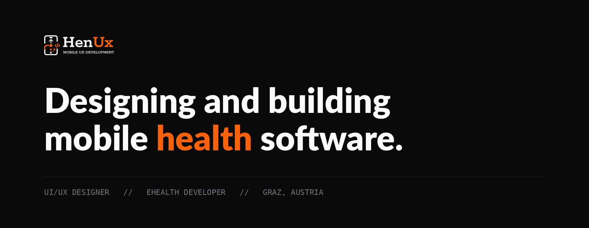

 

Finishing an MSc in eHealth at FH JOANNEUM. I build apps in Swift, Kotlin and
Flutter, and my day job is the other side of it: testing and releasing
telemedicine systems that run in Austrian care programmes.

Watching where software fails once real people depend on it is the best design
education I have had.

 

## Work

<table>
<tr>
<td width="170" align="center"></td>
<td>

#### [Pairfect](https://github.com/hennees/pairfect-showcase)

An app for two people. Built solo in nine months next to a full-time master's
and a job.

78,000 lines of Dart · serverless backend · subscriptions · offline maps · iOS widgets

</td>
</tr>
<tr>
<td align="center"></td>
<td>

#### [Amigon](https://github.com/hennees/amigon-showcase)

A mental health companion you talk to. Every result becomes an HL7 FHIR R4
Observation, so it still means something outside the app.

Master's thesis · 20 participants · <b>SUS 86.8</b> · Flutter · LLM and acoustic analysis

</td>
</tr>
<tr>
<td align="center"></td>
<td>

#### [Wearable Dashboard](https://github.com/hennees/strykerlabs-showcase)

Heart rate, sleep and activity from different vendors, harmonised into one model
for research. I built the Garmin integration and the dashboard.

With Strykerlabs GmbH · <a href="https://www.fh-joanneum.at/projekt/strykerlabs/">published by FH JOANNEUM</a> · TypeScript · OAuth 2.0 PKCE · webhooks

</td>
</tr>
</table>

Also: **[Scoon](https://github.com/hennees/scoon-showcase)**, a location
platform for photographers, and **[Anno Amsterdam](https://github.com/hennees/anno-amsterdam-showcase)**,
an AR app built for the city's 750th anniversary.

 

## Open source

**[exif_scrubber](https://github.com/hennees/exif_scrubber)** — strips EXIF and
XMP from JPEGs losslessly. Pure Dart, 17 tests. Pulled out of a production app,
where a photo leaving a phone carries its owner's home address in the file
header.

**[pokedex-swiftui](https://github.com/hennees/pokedex-swiftui)** · **[newsapp-compose](https://github.com/hennees/newsapp-compose)** — university projects from 2023 and 2024, published as they were written, each ending with what I would do differently now.

 

## Elsewhere

Most of what I build is private. Ask and I will walk you through the code, or
give you read access.

**[henux.at](https://henux.at)** &nbsp;·&nbsp; [LinkedIn](https://linkedin.com/in/hennespatrick) &nbsp;·&nbsp; [patrick.hennes27@gmail.com](mailto:patrick.hennes27@gmail.com)
