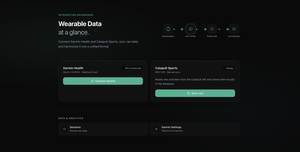

  

  
  
  
  
  
  
  
  
  

 

I'm Patrick, from Graz. Got into tech early and never really stopped. I found
UI/UX during an Erasmus semester in the Netherlands, on a project for the city
of Amsterdam, and that changed the direction of everything since.

Almost done with my MSc in eHealth at FH JOANNEUM, building mobile apps in
Swift, Kotlin and Flutter, and thinking a lot about how health and technology
can actually work well together. My day job is the other side of development: I
test and release telemedicine systems running in Austrian care programmes.
Seeing where software fails once real people depend on it changed how I build
it.

 

## Selected work

Some of this is a client's, an employer's, or holds other people's data. Those
get a written account and screenshots instead of source.

<table>
<tr>
<td width="26%" align="center"></td>
<td width="74%">

### [Pairfect](https://github.com/hennees/pairfect-showcase)

An app for two people: shared memories, a map of where you have been, plans and
daily rituals. Built solo alongside a full-time master's and a job. 78,000
lines of Dart across 11 feature modules, a serverless backend, subscriptions,
offline maps, iOS widgets. Nine months, 493 commits.

`Flutter` `Dart` `Firebase` `RevenueCat` `Mapbox` `WidgetKit`

</td>
</tr>
<tr>
<td align="center"></td>
<td>

### [Amigon](https://github.com/hennees/amigon-showcase)

Master's thesis. A mental health companion that lets people check in in their
own words, combining validated questionnaires with a voice journal the model
listens to. Every measurement becomes an HL7 FHIR R4 Observation. Evaluated
with 20 participants, **SUS 86.8**.

`Flutter` `Firebase` `Python` `HL7 FHIR R4` `LLM & acoustic analysis`

</td>
</tr>
<tr>
<td align="center"></td>
<td>

### [Wearable Dashboard](https://github.com/hennees/strykerlabs-showcase)

A health dashboard for wearable data, in collaboration with Strykerlabs GmbH,
Graz. Heart rate, sleep and activity from different vendors, harmonised into
one model. I built the Garmin integration and the dashboard.
[Published by FH JOANNEUM](https://www.fh-joanneum.at/projekt/strykerlabs/).

`TypeScript` `React` `OAuth 2.0 PKCE` `Webhooks` `PostgreSQL`

</td>
</tr>
<tr>
<td align="center"></td>
<td>

### [Scoon](https://github.com/hennees/scoon-showcase)

The platform for photographers, videographers and creators searching for the
best locations. Community-driven, and contributors earn from every spot they
add. Own venture with [ITanic GmbH](https://itanic.at) and
[Kyri Agency](https://www.kyri.agency/). I own product concept and user flows.
[scoon-app.com](https://scoon-app.com)

`Product concept` `UI/UX` `Figma`

</td>
</tr>
<tr>
<td align="center"></td>
<td>

### [Anno Amsterdam](https://github.com/hennees/anno-amsterdam-showcase)

AR tourism app for Amsterdam. Explore building information through augmented
reality and pick your own route through the city. The Erasmus project that got
me into this in the first place. I owned the frontend, native on both
platforms.

`Kotlin` `Swift` `Maps` `AR`

</td>
</tr>
</table>

 

## Open source

| | |
|---|---|
| **[exif_scrubber](https://github.com/hennees/exif_scrubber)** | Strips EXIF and XMP from JPEGs losslessly, without re-encoding pixels. Pure Dart, no plugins, 17 tests. Pulled out of a production app, where a photo leaving a phone carries its owner's home address in the file header. |
| **[pokedex-swiftui](https://github.com/hennees/pokedex-swiftui)** | A Pokédex with fluid animations and detailed profiles. My first iOS project, 2023. |
| **[newsapp-compose](https://github.com/hennees/newsapp-compose)** | Android news reader. Jetpack Compose, Hilt, Paging 3, clean architecture. 2024. |

Both university projects are published as they were written, each ending with a
section on what I would do differently now. A portfolio that only shows the good
parts is not a portfolio, it is a brochure.

 

## On AI

I use AI tools in basically everything I do, not as a shortcut, but because
they genuinely make the work better and faster. What I do not outsource is
knowing why the code looks the way it does. Ask me about any line in anything
here.

 

## Reviewing my code

Most of what I have built is not public. If you are evaluating me and want more
than the repositories above, there are two ways: a walkthrough on a call, or
read access to a specific repository for a specific person. Ask and you get
either.

 

  
  
  

Open to mobile and web roles in Graz, remote, or internationally.

